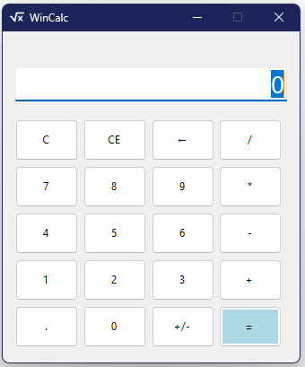

# WinCalc

WinCalc is a simple and modern calculator application developed using C# and Windows Forms in Visual Studio 2022. The application performs basic arithmetic operations with a clean and user-friendly interface.

---

## Features

- Addition
- Subtraction
- Multiplication
- Division
- Clear functionality
- Responsive Windows Forms UI
- Easy-to-use interface

---

## Technologies Used

- C#
- .NET Framework / .NET
- Windows Forms
- Visual Studio 2022

---

## Screenshot



---

## Getting Started

### Prerequisites

Before running the project, make sure you have:

- Visual Studio 2022
- .NET Framework installed

---

## Installation

1. Clone the repository:

```bash
git clone https://github.com/rony1duet/WinCalc.git
```

2. Open the solution file in Visual Studio 2022.

3. Build and run the project.

---

## Project Structure

```text
WinCalc/
├── assets/
│   ├── WinCalc.png
│   └── mainIcon.ico
├── CalculatorForm.cs
├── CalculatorForm.Designer.cs
├── Program.cs
└── README.md
```

---

## Usage

1. Launch the application.
2. Enter numbers using the calculator buttons.
3. Select an arithmetic operation.
4. Press `=` to view the result.

---

## Future Improvements

- Scientific calculator mode
- Calculation history
- Dark mode
- Keyboard input support

---

## Author

Developed by RONY.

---

## License

This project is open source and available under the MIT License.